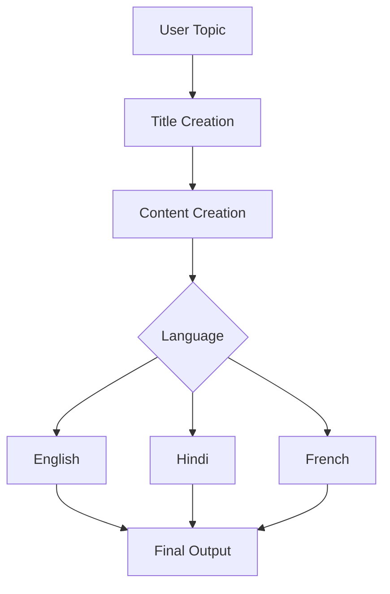

# 🚀 Agentic Blog Generator using LangGraph

An AI-powered Blog Generation System built using LangGraph, OpenAI, and Streamlit.

The application creates complete blogs from a user topic using a multi-agent workflow. It supports automatic blog generation, multilingual translation, state management, graph orchestration, and visual debugging through LangGraph Studio.

---

## 📌 Features

### Blog Generation

Generate complete blog articles from a topic.

Example:

Input:

```text
Artificial Intelligence in Healthcare
```

Output:

- SEO Friendly Title
- Detailed Blog Content
- Structured Sections
- Professional Formatting

---

### Multi-Language Translation

Automatically translate generated blogs into:

- English
- Hindi
- French

---

### Agentic Workflow

Instead of a single LLM call, the system follows a multi-node workflow:

```text
User Input
    ↓
Title Generator
    ↓
Content Generator
    ↓
Translation Node
    ↓
Final Output
```

---

### LangGraph Studio Support

Visualize and debug workflows using LangGraph Studio.

Features:

- Graph Visualization
- State Inspection
- Node Execution Tracking
- Streaming Outputs
- Run History

---

### Streamlit User Interface

Interactive frontend built using Streamlit.

Users can:

- Enter blog topics
- Select language
- Generate blogs
- View generated output

---

## 🏗️ Project Architecture

```text
┌─────────────────┐
│   Streamlit UI  │
└────────┬────────┘
         │
         ▼
┌─────────────────┐
│ LangGraph Graph │
└────────┬────────┘
         │
 ┌───────┼────────┐
 ▼       ▼        ▼

Title  Content  Translation
Node    Node      Node

         │
         ▼

      Output
```

---

## 📂 Project Structure

```text
AgenticChatBot
│
├── src
│   └── langgraphagenticai
│
│       ├── LLMs
│       │   ├── openaillm.py
│       │   └── groqllm.py
│       │
│       ├── graph
│       │   └── graph_builder.py
│       │
│       ├── nodes
│       │   ├── blog_node.py
│       │   ├── ai_news_node.py
│       │   ├── chatbot_with_tool_node.py
│       │   └── basicchatbot_node.py
│       │
│       ├── state
│       │   ├── state.py
│       │   └── blogstate.py
│       │
│       ├── tools
│       │   └── search_tool.py
│       │
│       ├── UI
│       │   └── Streamlitui
│       │
│       └── main.py
│
├── studio_graph.py
├── langgraph.json
├── pyproject.toml
├── requirement.txt
└── README.md
```

---

## 🧠 LangGraph Workflow

### State Object

The graph uses a custom state model.

```python
BlogState
```

Stores:

- Topic
- Generated Title
- Blog Content
- Translated Content
- Language

---

### Node 1 — Title Creation

Responsible for generating an engaging blog title.

Input:

```text
Topic
```

Output:

```text
SEO Friendly Blog Title
```

---

### Node 2 — Content Creation

Generates complete blog content.

Output:

```text
Introduction
Main Sections
Conclusion
```

---

### Node 3 — Translation

Translates generated content.

Supported:

- English
- Hindi
- French

---

## 🔄 Graph Flow



---

## ⚙️ Installation

### Clone Repository

```bash
git clone <your-repo-url>
cd AgenticChatBot
```

---

### Create Virtual Environment

```bash
python -m venv .venv
```

Activate:

```bash
source .venv/bin/activate
```

---

### Install Dependencies

```bash
pip install -r requirement.txt
```

---

## 🔑 Environment Variables

Create:

```bash
.env
```

Add:

```env
OPENAI_API_KEY=your_key_here
```

---

## ▶️ Running Streamlit UI

```bash
streamlit run app.py
```

---

## 🎨 Running LangGraph Studio

```bash
langgraph dev
```

Studio:

```text
http://127.0.0.1:2024
```

---

## 📊 Example Workflow

Input:

```text
Future of Artificial Intelligence
```

Graph Execution:

```text
Title Creation
↓
Content Creation
↓
French Translation
↓
Final Blog
```

---

## 🛠 Technologies Used

### Frameworks

- LangGraph
- LangChain
- Streamlit

### LLM Providers

- OpenAI GPT Models
- Groq

### Language

- Python

### State Management

- Typed State Objects
- LangGraph StateGraph

### Development Tools

- LangGraph Studio
- LangSmith
- Git
- VS Code

---

## Future Enhancements

- PDF Export
- DOCX Export
- SEO Scoring
- Blog Images Generation
- Multi-Agent Research Workflow
- Web Search Integration
- RAG Based Blog Writing
- Publish directly to Medium

---

## Author

### Seshank Rakshit

B.Tech CSE | Cybersecurity Enthusiast | Agentic AI Developer

- LangGraph
- LangChain
- OpenAI
- Streamlit
- Cybersecurity

Building practical AI systems and agentic workflows.
